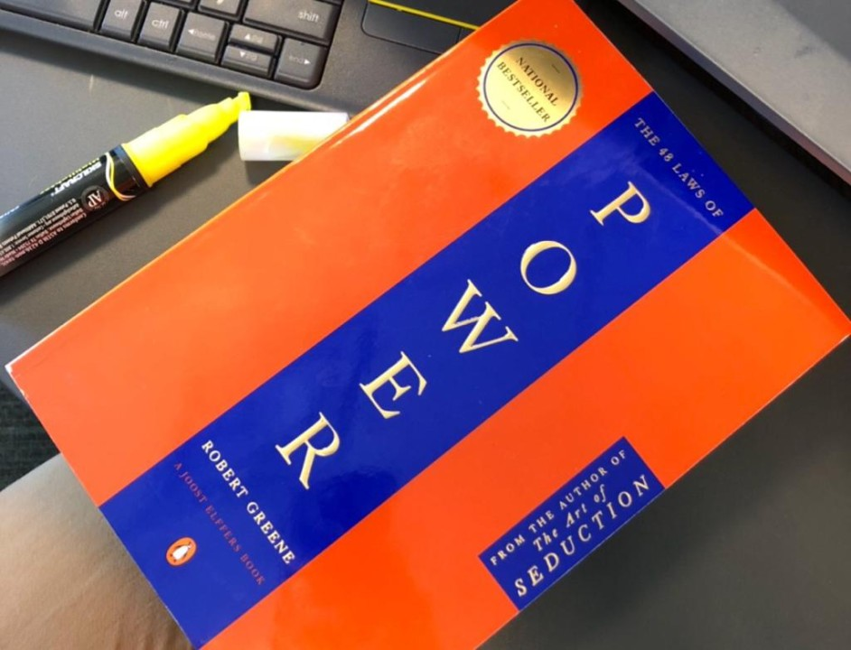

# The 48 Laws of Power 📘

> *“Power is not what you do — it’s what others think you do.”*  
> — Robert Greene, *The 48 Laws of Power*

## 📥 Download PDF

📄 [Click here to download the PDF](https://drive.google.com/file/d/1FFDzei9IqW99Gd2h43ohInm6IN4Q6bBb/view?usp=drivesdk)

## 🧠 About the Book

**The 48 Laws of Power** by Robert Greene is a modern classic that distills 3,000 years of history into 48 essential laws by which one can acquire, observe, or defend against power. The book draws from the philosophies and tactics of great historical figures, from Machiavelli to Sun Tzu.

